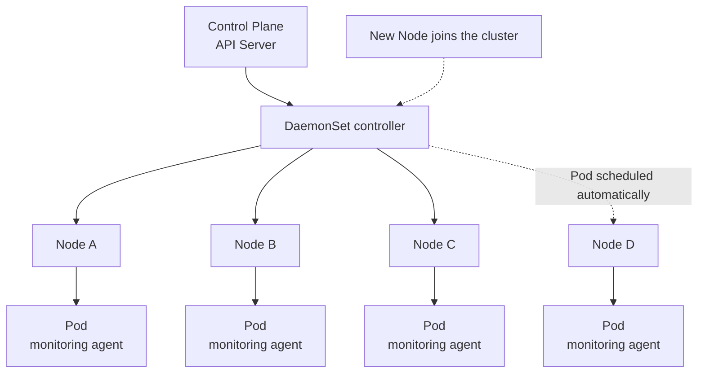

## Daemonset in Kubernetes

### What is a daemonset?
- A DaemonSet in Kubernetes is a workload controller that ensures a pod runs on all or some nodes in a cluster
- Example: If you create a daemonset in a cluster of 3 nodes, then 3 pods will be created. No need to manage replicas.
- If you add another node to the cluster, a new pod will be automatically created on the new node.

### How it works
- A DaemonSet controller monitors for new and deleted nodes, and adds or removes pods as needed.

### What it's used for
- Logging collection
- Kube-proxy
- Weave-net
- Node monitoring

### Example of Daemonset:




> **Figure:** A DaemonSet keeps exactly one Pod per node, including on nodes that join the cluster later.


- In the above screenshot, you can see 2 daemonsets are deployed in the kube-system namespace. i.e, Canal and Kube-proxy.
- Similarily, we can also create custom daemonset by following below steps.

### Steps to deploy daemonset:

- You will see 1 manifest in the same directory (DaemonSet) with name daemonset-deploy.yaml.
- Copy the content of the manifest and run the following command to deploy it.
```bash
kubectl apply -f daemonset-deploy.yaml
```
- After applying, you will see the daemonset pods are created and replicas are equal to the number of nodes including control-plane.


