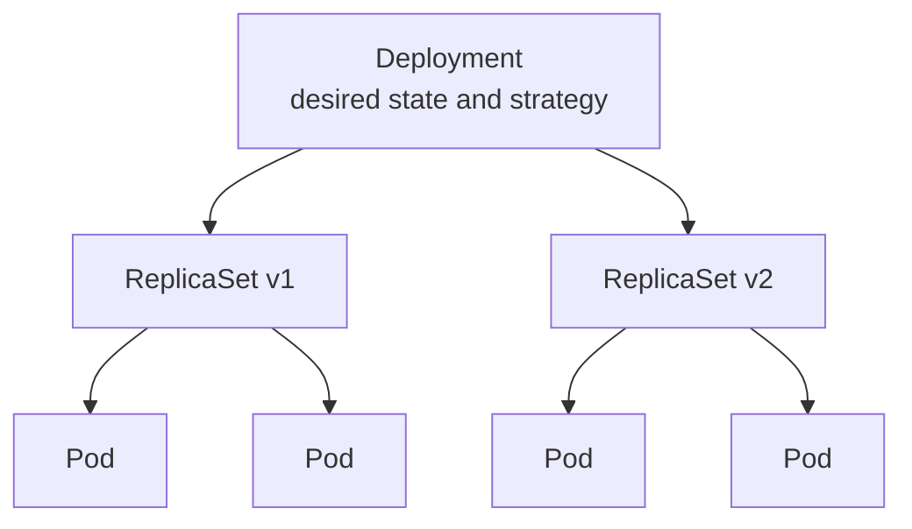

# Deployment Strategies in kubernetes

- What is Deployment and Deployment strategies ?
  
  - Deployment is a process of making a application available for use by audience.
  - Deployment strategies is a technique for changing/upgrading a running application from one version to another.

- Why do we need it ?

  - Zero downtime
  - Reduce time to market
  - Faster Rollback
  - More Frequency

> **Figure:** Ownership hierarchy — a Deployment owns ReplicaSets, and each ReplicaSet owns the Pods it created. A new version means a new ReplicaSet.

## Types of deployment strategies

| Types    | Links |
| -------- | ------- |
| Recreate | <a href="https://github.com/LondheShubham153/kubestarter/tree/main/Deployment_Strategies/Recreate-deployment">Click me</a>     |
| Rolling Update | <a href="https://github.com/LondheShubham153/kubestarter/tree/main/Deployment_Strategies/Rolling-Update-Deployment">Click me</a>     |
| Blue-green | <a href="https://github.com/LondheShubham153/kubestarter/tree/main/Deployment_Strategies/Blue-green-deployment">Click me</a>     |
| Canary | <a href="https://github.com/LondheShubham153/kubestarter/tree/main/Deployment_Strategies/Simple-Canary-Example">Click me</a>     |
