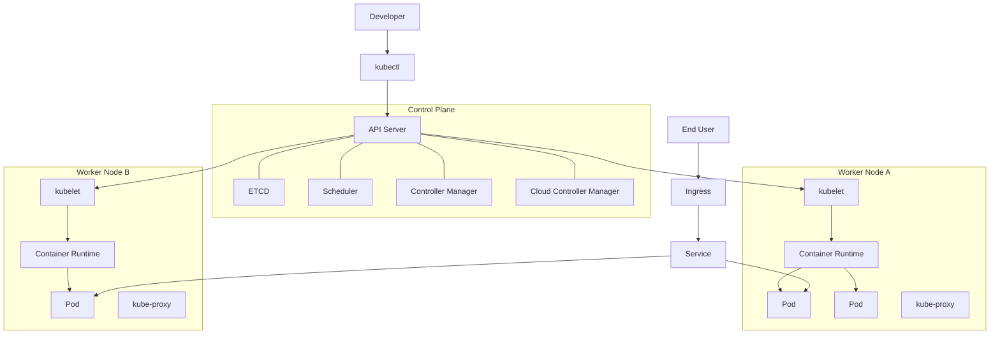

## Kubernetes Kickstarter

## Cluster Architecture at a Glance

> **Figure:** The full Kubernetes cluster — control plane components, worker nodes and the path user traffic takes to reach a Pod.

## Architecture Guides

1. [Kubernetes Architecture Guide](./kubernetes_architecture.md)

## Cheat Sheet

1. [Kubernetes Cheat Sheet](./cheat-sheet/kubernetes-cheatsheet.md) - Every kubectl and helm command worth remembering, grouped by task

## Examples with Interview Questions

1. [NGINX with Deployment & Service](./examples/nginx)
2. [MySQL with ConfigMaps, Secrets & Persistent Volumes](./examples/mysql)
3. [All Examples Index](./examples/) - What each example demonstrates and the order to work through them

## Installation Guides

1. [Kubeadm Installation Scripts](./Kubeadm_Installation_Scripts_and_Documentation/)
2. [Minikube Installation Guide](./minikube_installation.md)
3. [EKS Installation Guide](./eks_cluster_setup.md)

```mermaid
flowchart LR
    A["Architecture"] --> B["Installation<br/>Minikube · KIND · Kubeadm · EKS"]
    B --> C["Workloads<br/>Pod · Deployment · DaemonSet"]
    C --> D["Configuration<br/>ConfigMap · Secret"]
    D --> E["Storage<br/>PersistentVolume · PersistentVolumeClaim"]
    E --> F["Networking<br/>Service · Ingress"]
    F --> G["Scaling<br/>HPA · VPA"]
    G --> H["Security<br/>RBAC"]
    H --> I["Scheduling<br/>Taints and Tolerations"]
    I --> J["Packaging<br/>Helm"]
    J --> K["Deployment Strategies"]
    K --> L["CI/CD with Kubernetes"]
```

> **Figure:** Suggested learning path through the topics covered in this repository.

## Kubernetes Concepts Covered in this Repository:

### Core Kubernetes Components & Architecture
1. [Kubernetes Architecture](./kubernetes_architecture.md) - Control Plane, Worker Nodes, etcd, API Server, Scheduler, Controller Manager
2. **Pods** - [NGINX Example](./examples/nginx/pod.yml) - Smallest deployable units in Kubernetes
3. **Services** - [NGINX Example](./examples/nginx/service.yml) - Network abstraction for accessing Pods
4. **Deployments** - [NGINX Example](./examples/nginx/deployment.yml) - Declarative updates and lifecycle management for Pods
5. **Namespaces** - Virtual clusters for resource isolation and organization

### Workload Controllers
6. **DaemonSet** - [Examples](./DaemonSet/) - Ensures pods run on all/selected nodes

### Configuration & Secrets Management
7. **ConfigMaps** - [MySQL Example](./examples/mysql/configMap.yml) - Non-confidential configuration data
8. **Secrets** - [MySQL Example](./examples/mysql/secrets.yml) - Sensitive information like passwords

### Storage & Persistence
9. **Persistent Volumes (PV)** - [Examples](./PersistentVolumes/) - Cluster-wide storage resources
10. **Persistent Volume Claims (PVC)** - [Examples](./PersistentVolumes/) - Storage requests by users
11. **Volume Mounts** - [MySQL Example](./examples/mysql/persistentVols.yml) - Attaching storage to containers

### Networking & Traffic Management
12. **Ingress** - [Examples](./Ingress/) - HTTP/HTTPS traffic routing and load balancing
13. **Ingress Controllers** - [Setup Guide](./Ingress/README.md) - Implementation of Ingress rules

### Auto-scaling & Resource Management
14. **Horizontal Pod Autoscaler (HPA)** - [Examples](./HPA_VPA/) - Automatic scaling based on CPU/memory
15. **Vertical Pod Autoscaler (VPA)** - [Examples](./HPA_VPA/) - Automatic resource adjustment
16. **Resource Requests & Limits** - [HPA Example](./HPA_VPA/apache-deployment.yml) - CPU and memory constraints

### Security & Access Control
17. **Role-Based Access Control (RBAC)** - [Examples](./RBAC/) - Fine-grained permissions
18. **Roles & RoleBindings** - [Examples](./RBAC/) - Namespace-scoped permissions
19. **Service Accounts** - [Examples](./RBAC/) - Identity for pods and processes

### Node Management & Scheduling
20. **Taints and Tolerations** - [Examples](./Taints-and-Tolerations/) - Node scheduling constraints

### Package Management & Templating
21. **Helm Charts** - [Examples](./HELM/) - Kubernetes package manager
22. **Helm Templates** - [Apache Chart](./HELM/apache/) - Parameterized Kubernetes manifests
23. **Helm Values** - [Apache Chart](./HELM/apache/values.yaml) - Configuration management for charts

### Deployment Strategies
24. **Rolling Updates** - [Examples](./Deployment_Strategies/Rolling-Update-Deployment/) - Gradual application updates
25. **Recreate Deployment** - [Examples](./Deployment_Strategies/Recreate-deployment/) - Stop-and-start deployment
26. **Blue-Green Deployment** - [Examples](./Deployment_Strategies/Blue-green-deployment/) - Zero-downtime deployments
27. **Canary Deployment** - [Examples](./Deployment_Strategies/Canary-deployment/) - Gradual traffic shifting
28. **Simple Canary Example** - [Examples](./Deployment_Strategies/Simple-Canary-Example/) - Basic canary deployment pattern

### CI/CD Integration
29. **CI/CD with Kubernetes** - [Guide](./ci_cd_with_kubernetes.md) - Continuous integration and deployment

### Cluster Setup & Management
30. **Kubeadm Installation** - [Scripts & Docs](./Kubeadm_Installation_Scripts_and_Documentation/) - Production cluster setup
31. **Minikube Setup** - [Installation Guide](./minikube_installation.md) - Local development clusters
32. **KIND Clusters** - [Setup Guide](./kind-cluster/) - Kubernetes in Docker for testing
33. **EKS Cluster Setup** - [AWS Guide](./eks_cluster_setup.md) - Managed Kubernetes on AWS

### Monitoring & Observability
34. **Kubernetes Dashboard** - [KIND Setup](./kind-cluster/) - Web-based cluster management
35. **Metrics Server** - [HPA Setup](./HPA_VPA/README.md) - Resource usage monitoring

### Real-World Applications
36. **Multi-tier Applications** - [NGINX Example](./examples/nginx/), [MySQL Example](./examples/mysql/)
37. **Microservices Architecture** - [Practice Projects](./examples/More_K8s_Practice_Ideas.md)
38. **Database Deployments** - [MySQL with Persistence](./examples/mysql/) - Stateful application patterns
39. **Web Application Hosting** - [NGINX Deployment](./examples/nginx/) - Complete application stacks
