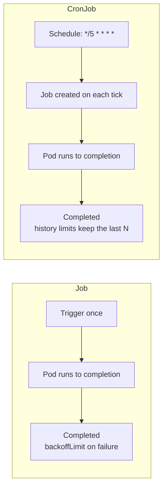

# Kubernetes Cheat Sheet

> Every command worth remembering, grouped by what you are trying to do.
> The *why* lives in the guides across this repository — this page is for when
> you already know and just need the flag.

[← README](../README.md)

---

## Contents

[Cluster and context](#cluster-and-context) · [Namespaces](#namespaces) ·
[Pods](#pods) · [Deployments and ReplicaSets](#deployments-and-replicasets) ·
[Rollouts](#rollouts) · [DaemonSet, StatefulSet, Job, CronJob](#daemonset-statefulset-job-cronjob) ·
[Services and networking](#services-and-networking) · [Ingress](#ingress) ·
[ConfigMaps and Secrets](#configmaps-and-secrets) · [Storage](#storage) ·
[Scheduling](#scheduling-nodes-taints-affinity) · [Autoscaling](#autoscaling) ·
[RBAC](#rbac) · [Helm](#helm) · [Logs and debugging](#logs-and-debugging) ·
[Resource inspection](#resource-inspection-and-output-formatting) ·
[Cleanup](#cleanup) · [Local clusters](#local-clusters) ·
[Exit and status reference](#exit-and-status-reference)

---

## Cluster and context

```bash
kubectl version --short                          # client and server versions
kubectl cluster-info                             # control plane endpoints
kubectl cluster-info dump                        # full state, for a bug report
kubectl api-resources                            # every resource kind + short name
kubectl api-versions                             # served API groups/versions
kubectl get nodes -o wide                        # nodes, IPs, OS, runtime versions

kubectl config get-contexts                      # all contexts
kubectl config current-context                   # the one you are pointed at
kubectl config use-context kind-kind             # switch cluster
kubectl config set-context --current --namespace=dev   # default namespace
kubectl config view --minify                     # only the current context
```

---

## Namespaces

```bash
kubectl get namespaces                           # alias: ns
kubectl create namespace dev
kubectl get pods -n dev
kubectl get pods -A                              # all namespaces
kubectl delete namespace dev                     # deletes everything inside it
kubectl describe namespace dev
kubectl get all -n dev                           # common resources in one view
```

---

## Pods

```bash
kubectl run nginx --image=nginx:1.27-alpine      # a bare Pod
kubectl run tmp --rm -it --image=busybox -- sh   # throwaway debug Pod
kubectl get pods -o wide                         # + node, Pod IP
kubectl get pods --watch                         # stream status changes
kubectl get pods --field-selector status.phase=Running
kubectl get pods -l app=nginx                    # by label
kubectl get pods --sort-by=.status.startTime

kubectl describe pod web-0                       # events are at the bottom, read them first
kubectl delete pod web-0                         # the controller recreates it
kubectl delete pod web-0 --grace-period=0 --force   # last resort, stuck Pod

kubectl exec -it web-0 -- sh                     # shell inside
kubectl exec web-0 -c sidecar -- env             # a specific container
kubectl cp web-0:/var/log/app.log ./app.log      # copy a file out
kubectl port-forward pod/web-0 8080:80           # reach it from localhost
kubectl debug -it web-0 --image=busybox --target=app   # ephemeral debug container
kubectl top pod                                  # needs Metrics Server
```

---

## Deployments and ReplicaSets

```bash
kubectl create deployment web --image=nginx:1.27-alpine --replicas=3
kubectl get deploy,rs,pods -l app=web            # the whole ownership chain
kubectl scale deployment web --replicas=5
kubectl set image deployment/web nginx=nginx:1.27.1-alpine
kubectl set resources deployment web --requests=cpu=100m,memory=128Mi --limits=cpu=500m,memory=512Mi
kubectl edit deployment web                      # opens the live object
kubectl explain deployment.spec.strategy         # field-level docs, offline

# Generate a manifest instead of creating the object
kubectl create deployment web --image=nginx --dry-run=client -o yaml > deployment.yaml
kubectl apply -f deployment.yaml
kubectl apply -f ./manifests/                    # a whole directory
kubectl diff -f deployment.yaml                  # what apply would change
kubectl delete -f deployment.yaml
```

---

## Rollouts

```bash
kubectl rollout status deployment/web            # blocks until complete or stuck
kubectl rollout history deployment/web
kubectl rollout history deployment/web --revision=3
kubectl rollout undo deployment/web              # back one revision
kubectl rollout undo deployment/web --to-revision=2
kubectl rollout pause deployment/web             # stage several edits
kubectl rollout resume deployment/web
kubectl rollout restart deployment/web           # recreate Pods, same image
kubectl annotate deployment/web kubernetes.io/change-cause="upgrade to 1.27.1"
```

Rolling update knobs (`spec.strategy.rollingUpdate`):

| Field | Meaning | Typical value |
|-------|---------|---------------|
| `maxSurge` | Extra Pods allowed above `replicas` during the rollout | `25%` or `1` |
| `maxUnavailable` | Pods allowed to be down during the rollout | `25%` or `0` |
| `minReadySeconds` | How long a Pod must stay ready before it counts | `10` |
| `progressDeadlineSeconds` | When to mark the rollout failed | `600` |

---

## DaemonSet, StatefulSet, Job, CronJob

```bash
kubectl get daemonset -A                         # alias: ds
kubectl rollout status ds/node-exporter -n monitoring

kubectl get statefulset                          # alias: sts
kubectl scale sts mysql --replicas=3             # ordered, one at a time
kubectl delete sts mysql --cascade=orphan        # keep the Pods

kubectl create job backup --image=busybox -- /bin/sh -c 'echo backup'
kubectl get jobs
kubectl logs job/backup
kubectl delete job backup

kubectl create cronjob report --image=busybox --schedule="*/5 * * * *" -- /bin/sh -c 'echo report'
kubectl get cronjob
kubectl create job --from=cronjob/report report-manual   # trigger now
kubectl patch cronjob report -p '{"spec":{"suspend":true}}'
```



> **Figure:** A Job runs a Pod to completion once; a CronJob creates a new Job on every scheduled tick.

---

## Services and networking

```bash
kubectl expose deployment web --port=80 --target-port=8080          # ClusterIP
kubectl expose deployment web --type=NodePort --port=80
kubectl expose deployment web --type=LoadBalancer --port=80
kubectl get svc -o wide                          # + selector
kubectl get endpointslices -l kubernetes.io/service-name=web        # the real backends
kubectl describe svc web                         # empty Endpoints means a selector mismatch
kubectl port-forward svc/web 8080:80

# DNS and connectivity checks from inside the cluster
kubectl run netcheck --rm -it --image=busybox:1.36 -- sh
#   nslookup web.default.svc.cluster.local
#   wget -qO- http://web.default.svc.cluster.local
kubectl get pods -n kube-system -l k8s-app=kube-dns                 # CoreDNS
kubectl logs -n kube-system -l k8s-app=kube-dns
```

| Service type | Reachable from | Built on |
|--------------|----------------|----------|
| `ClusterIP` | Inside the cluster only | — |
| `NodePort` | `NodeIP:30000-32767` | ClusterIP |
| `LoadBalancer` | Internet, via a cloud load balancer | NodePort |
| `ExternalName` | CNAME to an external host | — |
| Headless (`clusterIP: None`) | DNS returns Pod IPs directly | — |

---

## Ingress

```bash
kubectl get ingress -A
kubectl describe ingress web-ingress             # rules, backends, events
kubectl get ingressclass
kubectl get pods -n ingress-nginx
kubectl logs -n ingress-nginx -l app.kubernetes.io/component=controller -f
minikube addons enable ingress                   # Minikube
kubectl create ingress web --class=nginx --rule="app.example.com/*=web:80"
```

---

## ConfigMaps and Secrets

```bash
kubectl create configmap app-config --from-literal=LOG_LEVEL=debug
kubectl create configmap app-config --from-file=./config/            # every file in the directory
kubectl get configmap app-config -o yaml
kubectl describe configmap app-config

kubectl create secret generic db-secret --from-literal=password='s3cr3t'
kubectl create secret docker-registry regcred \
  --docker-server=ghcr.io --docker-username=USER --docker-password=TOKEN
kubectl create secret tls web-tls --cert=tls.crt --key=tls.key
kubectl get secret db-secret -o jsonpath='{.data.password}' | base64 -d

# Roll Pods after a config change, nothing restarts on its own
kubectl rollout restart deployment/web
```

> ⚠️ Secret values are base64-encoded, not encrypted. Enable encryption at rest, keep them out of Git, and restrict them with RBAC.

---

## Storage

```bash
kubectl get pv                                   # cluster-wide volumes
kubectl get pvc -A                               # claims
kubectl get storageclass                         # alias: sc
kubectl describe pvc data-web-0                  # Pending usually means no matching PV or StorageClass
kubectl patch pv pv-01 -p '{"spec":{"persistentVolumeReclaimPolicy":"Retain"}}'
kubectl delete pvc data-web-0                    # a StatefulSet will not recreate it for you
```

| Access mode | Meaning |
|-------------|---------|
| `ReadWriteOnce` | Mounted read-write by one node |
| `ReadOnlyMany` | Mounted read-only by many nodes |
| `ReadWriteMany` | Mounted read-write by many nodes (NFS, EFS) |
| `ReadWriteOncePod` | Exactly one Pod, cluster-wide |

| Reclaim policy | On PersistentVolumeClaim delete |
|----------------|---------------------------------|
| `Delete` | The PersistentVolume and backing disk are removed |
| `Retain` | The PersistentVolume stays, released, for manual recovery |

---

## Scheduling: nodes, taints, affinity

```bash
kubectl get nodes --show-labels
kubectl label node worker-1 disktype=ssd
kubectl taint node worker-1 key=value:NoSchedule       # add
kubectl taint node worker-1 key=value:NoSchedule-      # remove, note the trailing dash
kubectl describe node worker-1
kubectl cordon worker-1                          # no new Pods
kubectl drain worker-1 --ignore-daemonsets --delete-emptydir-data
kubectl uncordon worker-1
kubectl top node                                 # needs Metrics Server
kubectl get events --field-selector reason=FailedScheduling
```

| Taint effect | Result |
|--------------|--------|
| `NoSchedule` | New Pods without a matching toleration are not scheduled |
| `PreferNoSchedule` | Best-effort avoidance |
| `NoExecute` | Existing Pods without a toleration are evicted |

---

## Autoscaling

```bash
kubectl autoscale deployment web --min=2 --max=10 --cpu-percent=50
kubectl get hpa
kubectl describe hpa web                         # current vs target utilization
kubectl top pod                                  # what the HPA is reading

# Metrics Server, required by HPA and by kubectl top
kubectl apply -f https://github.com/kubernetes-sigs/metrics-server/releases/latest/download/components.yaml
kubectl get deploy metrics-server -n kube-system

kubectl get vpa                                  # VPA CRD, installed separately
kubectl describe vpa apache-vpa                  # recommendations per container
```

---

## RBAC

```bash
kubectl create serviceaccount app-sa -n dev
kubectl create role pod-reader --verb=get,list,watch --resource=pods -n dev
kubectl create rolebinding app-sa-reader --role=pod-reader --serviceaccount=dev:app-sa -n dev
kubectl create clusterrole node-reader --verb=get,list --resource=nodes
kubectl create clusterrolebinding app-node-reader --clusterrole=node-reader --serviceaccount=dev:app-sa

kubectl get roles,rolebindings -n dev
kubectl get clusterroles,clusterrolebindings

# Test permissions without switching identity
kubectl auth can-i create deployments -n dev
kubectl auth can-i list pods -n dev --as=system:serviceaccount:dev:app-sa
kubectl auth can-i --list --as=system:serviceaccount:dev:app-sa -n dev
kubectl get pods -n dev --as=system:serviceaccount:dev:app-sa       # impersonation
```

| Object | Scope |
|--------|-------|
| `Role` | One namespace |
| `ClusterRole` | Whole cluster, and cluster-scoped resources |
| `RoleBinding` | Grants a Role or a ClusterRole inside one namespace |
| `ClusterRoleBinding` | Grants a ClusterRole cluster-wide |

---

## Helm

```bash
helm repo add bitnami https://charts.bitnami.com/bitnami
helm repo update
helm search repo nginx
helm show values bitnami/nginx > values.yaml     # every knob the chart exposes

helm install web ./apache                        # release name plus chart path
helm install web bitnami/nginx -f values.yaml --namespace dev --create-namespace
helm upgrade --install web ./apache --set replicaCount=3   # idempotent deploy
helm template web ./apache                       # render locally, apply nothing
helm lint ./apache
helm list -A
helm status web
helm history web
helm rollback web 1
helm uninstall web
helm package ./apache                            # produces apache-0.1.0.tgz
helm dependency update ./apache
```

---

## Logs and debugging

```bash
kubectl logs web-0
kubectl logs web-0 -c sidecar                    # multi-container Pod
kubectl logs -f web-0                            # follow
kubectl logs --previous web-0                    # the container that just crashed
kubectl logs -l app=web --all-containers --tail=100     # by label, across Pods
kubectl logs --since=15m -l app=web

kubectl get events --sort-by=.lastTimestamp
kubectl get events -n dev --field-selector type=Warning
kubectl describe pod web-0                       # the Events section explains most failures
```

Fixed investigation order when a Pod is not serving traffic:

1. `kubectl get pods` — what phase is it in?
2. `kubectl describe pod` — read the **Events** at the bottom.
3. `kubectl logs --previous` — why did the last container exit?
4. `kubectl get endpointslices` — does the Service actually have backends?
5. `kubectl exec` plus `nslookup` or `wget` — is it DNS, or is it the application?

| Pod status | Usual cause |
|------------|-------------|
| `Pending` | No node fits: resources, taints, node selector, or an unbound PersistentVolumeClaim |
| `ImagePullBackOff` / `ErrImagePull` | Wrong tag, private registry, missing `imagePullSecrets` |
| `CrashLoopBackOff` | The application exits on startup, read `logs --previous` |
| `CreateContainerConfigError` | A referenced ConfigMap or Secret key does not exist |
| `OOMKilled` | Memory limit too low, or a leak |
| `Terminating`, stuck | A finalizer, or a volume that will not detach |
| `Running` but not ready | The readiness probe is failing |

---

## Resource inspection and output formatting

```bash
kubectl get pod web-0 -o yaml                    # full live object
kubectl get pod web-0 -o json | jq '.status.containerStatuses'
kubectl get pods -o custom-columns='NAME:.metadata.name,NODE:.spec.nodeName,IMAGE:.spec.containers[*].image'
kubectl get deploy web -o jsonpath='{.spec.template.spec.containers[0].image}'

kubectl patch deployment web -p '{"spec":{"replicas":4}}'
kubectl annotate pod web-0 owner=platform-team
kubectl label pod web-0 tier=frontend --overwrite
kubectl get pods --selector='env in (prod,staging),tier!=cache'
kubectl explain pod.spec.containers.livenessProbe --recursive
```

---

## Cleanup

```bash
kubectl delete pod -l app=web
kubectl delete deploy,svc,ingress -l app=web
kubectl delete -f ./manifests/
kubectl delete all --all -n dev                  # does NOT delete PVCs, ConfigMaps or Secrets
kubectl delete namespace dev                     # the thorough option
kubectl delete pods --field-selector status.phase=Failed -A
kubectl patch pvc data-web-0 -p '{"metadata":{"finalizers":null}}'   # unstick a terminating claim
```

---

## Local clusters

```bash
# Minikube
minikube start --cpus=2 --memory=4g --driver=docker
minikube status
minikube addons list
minikube addons enable ingress
minikube addons enable metrics-server
minikube service web --url                       # reachable URL for a NodePort Service
minikube tunnel                                  # LoadBalancer Services on a laptop
minikube dashboard
minikube stop
minikube delete

# KIND
kind create cluster --name dev --config kind-config.yml
kind get clusters
kind load docker-image myapp:1.0 --name dev      # skip the registry round trip
kubectl config use-context kind-dev
kind delete cluster --name dev

# kubeadm
kubeadm token create --print-join-command        # on the master, to add a worker
kubeadm reset -f                                 # tear a node back down
```

---

## Exit and status reference

| Container exit code | Meaning |
|---------------------|---------|
| `0` | Clean exit |
| `1` | Application error |
| `125` | Container runtime failed to run |
| `126` | Command found but not executable |
| `127` | Command not found, check the entrypoint path |
| `137` | SIGKILL, usually `OOMKilled` or a failed graceful shutdown |
| `139` | SIGSEGV, segmentation fault |
| `143` | SIGTERM, normal termination during a rollout |

| Probe | Failure means |
|-------|---------------|
| `livenessProbe` | The container is restarted |
| `readinessProbe` | The Pod is removed from Service endpoints, not restarted |
| `startupProbe` | Liveness and readiness are held off until it passes |

---

[← README](../README.md) · [Kubernetes Architecture](../kubernetes_architecture.md) · [Examples](../examples/)
