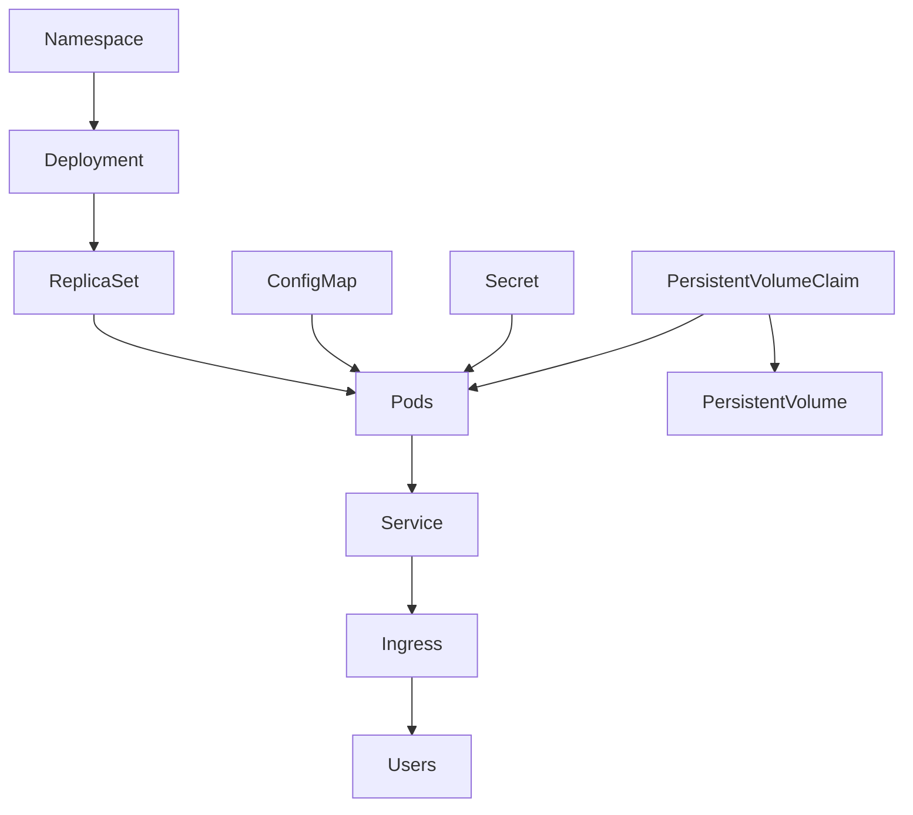

# Examples

Every example is a self-contained set of manifests that makes one idea concrete.
Each directory has its own README with the walkthrough, the manifests worth
reading, and the interview questions that go with the concept.

| Example | Stack | Demonstrates | Related guide |
|---------|-------|--------------|---------------|
| [nginx](nginx/) | NGINX | Pod, Deployment, Service, Namespace — the smallest complete web stack | [Kubernetes Architecture](../kubernetes_architecture.md) |
| [mysql](mysql/) | MySQL | ConfigMap, Secret, PersistentVolume and PersistentVolumeClaim for stateful data | [PersistentVolumes](../PersistentVolumes/) |
| [helm](helm/) | Helm chart | Templating, values, releases, upgrade and rollback | [HELM](../HELM/) |
| [More_K8s_Practice_Ideas](More_K8s_Practice_Ideas.md) | Robot Shop · WordPress · Cassandra · Jenkins | Larger multi-service applications to practice on | [Practice Projects](../README.md#practice-projects) |

## How the pieces fit together



> **Figure:** The objects used across these examples and how they reference each other.

## Running any of them

```bash
cd examples/<name>
kubectl apply -f .                 # create everything in the directory
kubectl get all                    # check what came up
kubectl get pods -w                # wait for Running
kubectl logs -l app=<label> -f     # follow the application logs
kubectl delete -f .                # clean up
```

## Requirements

- A running cluster: [Minikube](../minikube_installation.md), [KIND](../kind-cluster/), [kubeadm](../Kubeadm_Installation_Scripts_and_Documentation/) or [EKS](../eks_cluster_setup.md)
- `kubectl` configured against it — `kubectl get nodes` should return `Ready`
- Helm 3 for the [helm](helm/) example
- An Ingress Controller if you want to reach a Service by hostname — see [Ingress](../Ingress/)

## Suggested order

1. **nginx** — the shape of a normal stateless service
2. **mysql** — where configuration and data actually live
3. **helm** — packaging the same objects so they can be versioned and rolled back
4. **More_K8s_Practice_Ideas** — full applications to build on your own

Command reference for all of the above: [cheat-sheet/kubernetes-cheatsheet.md](../cheat-sheet/kubernetes-cheatsheet.md)
