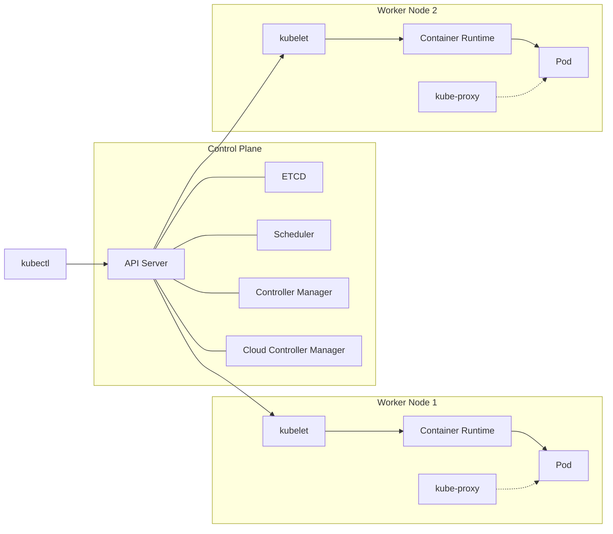
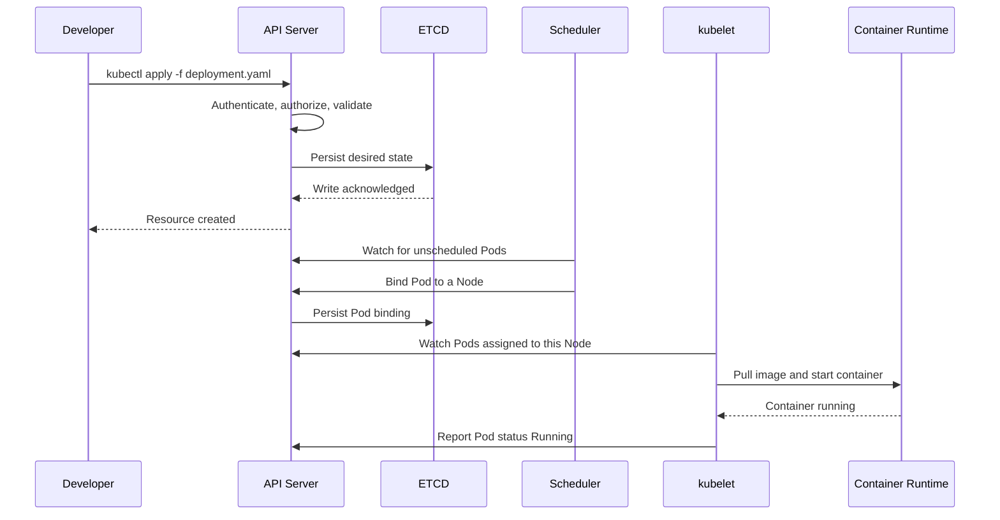
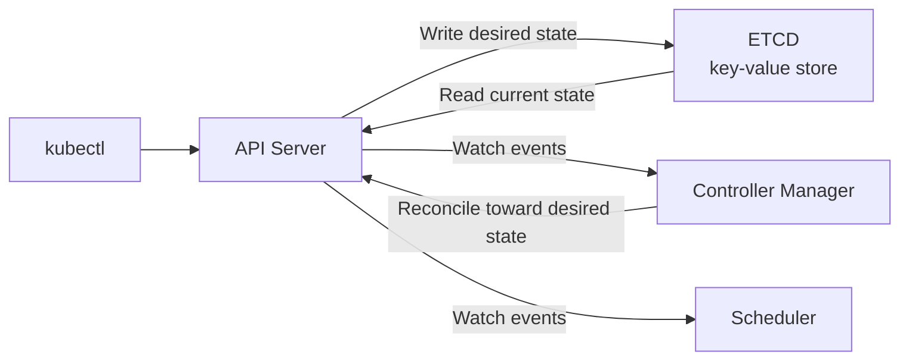
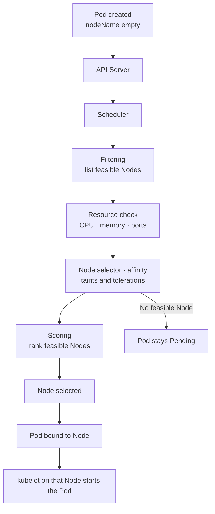
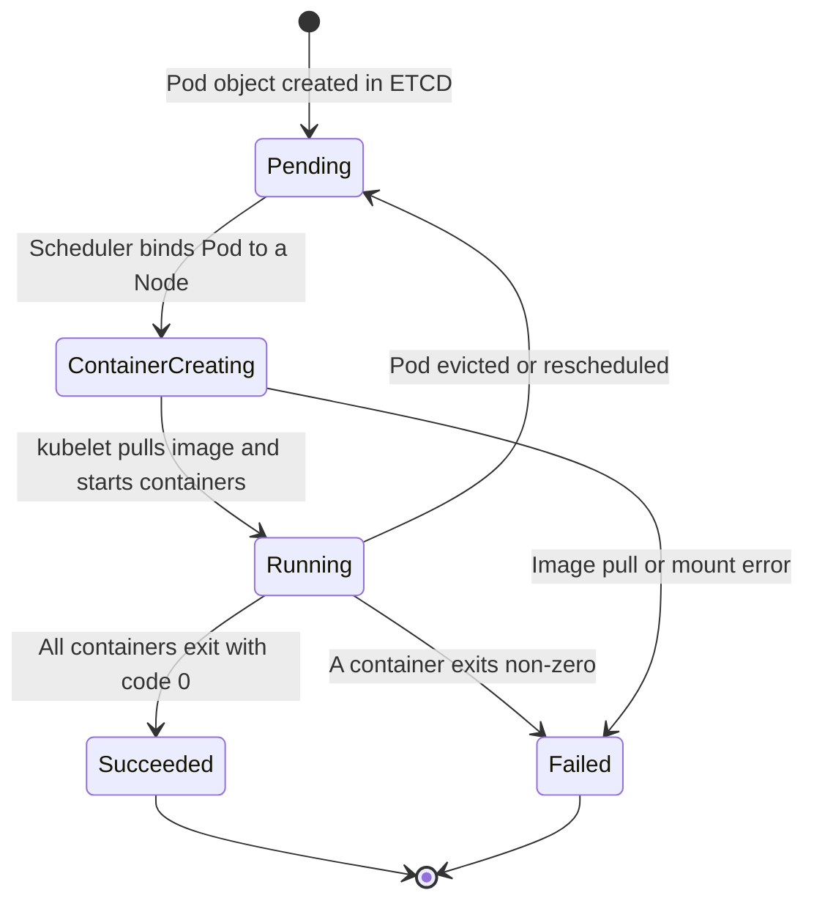
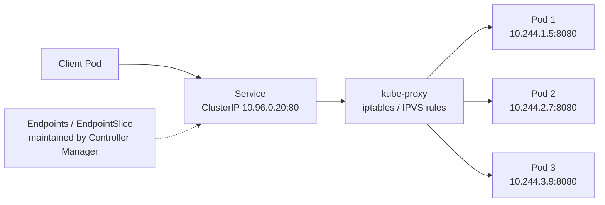
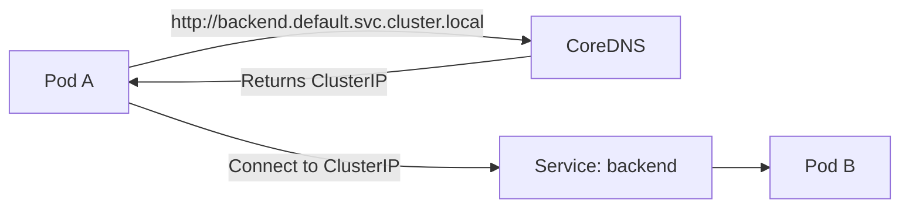
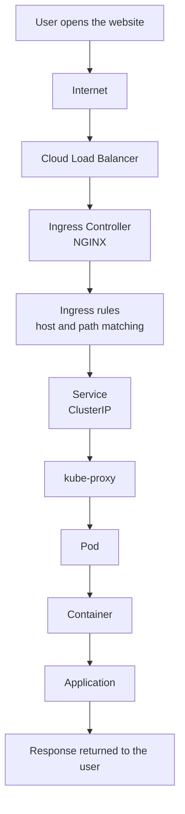

# Kubernetes Architecture Explained

This document explains the key components that make up the architecture of a Kubernetes cluster, in simple terms.

## Table of Contents

- [Control Plane (Master Node Components)](#control-plane-master-node-components)
- [Worker Node Components](#worker-node-components)
- [Other Components](#other-components)

---

> **Figure:** Control plane components on the left, worker node components on the right — every instruction flows through the API Server.

### What happens when you run `kubectl apply`

> **Figure:** The control plane workflow triggered by a single `kubectl apply`.

## Control Plane (Master Node Components)

### API Server

This is the "front desk" of Kubernetes. Whenever you want to interact with your cluster, your request goes through the API Server. It validates and processes these requests to the backend components.

### etcd

Think of this as the "database" of Kubernetes. It stores all the information about your cluster—what nodes are part of the cluster, what pods are running, what their statuses are, and more.

> **Figure:** ETCD is the single source of truth — only the API Server talks to it, and controllers reconcile the cluster toward the state stored there.

### Scheduler

The "event planner" for your containers. When you ask for a container to be run, the Scheduler decides which machine (Node) in your cluster should run it. It considers resource availability and other constraints while making this decision.

> **Figure:** How the Scheduler filters, scores and finally binds a Pod to a worker node.

### Controller Manager

Imagine a bunch of small robots that continuously monitor the cluster to make sure everything is running smoothly. If something goes wrong (e.g., a Pod crashes), they work to fix it, ensuring the cluster state matches your desired state.

### Cloud Controller Manager

This is a specialized component that allows Kubernetes to interact with the underlying cloud provider, like AWS or Azure. It helps in tasks like setting up load balancers and persistent storage.

---

## Worker Node Components

### kubelet

This is the "manager" for each worker node. It ensures all containers on the node are healthy and running as they should be.

### kube-proxy

Think of this as the "traffic cop" for network communication either between Pods or from external clients to Pods. It helps in routing the network traffic appropriately.

### Container Runtime

This is the software used to run containers. Docker is commonly used, but other runtimes like containerd can also be used.

---

## Other Components

### Pod

The smallest unit in Kubernetes, a Pod is a group of one or more containers. Think of it like an apartment in an apartment building.

> **Figure:** Pod lifecycle states — the kubelet drives every transition from `ContainerCreating` onward and reports each state back to the API Server.

### Service

This is like a phone directory for Pods. Since Pods can come and go, a Service provides a stable "address" so that other parts of your application can find them.

> **Figure:** A Service gives a stable virtual IP; kube-proxy load balances each connection across the healthy Pods behind it.

> **Figure:** Service discovery — CoreDNS resolves the Service name to its ClusterIP, which is why Pods can reach each other by name instead of by IP.

### Volume

This is like an external hard-drive that can be attached to a Pod to store data.

### Namespace

A way to divide cluster resources among multiple users or teams. Think of it as having different folders on a shared computer, where each team can only see their own folder.

### Ingress

Think of this as the "front door" for external access to your applications, controlling how HTTP and HTTPS traffic should be routed to your services.

> **Figure:** The complete request lifecycle — from a browser on the internet all the way to the application process inside a container, and back.

---

And there you have it! That's a simplified breakdown of Kubernetes architecture components.

